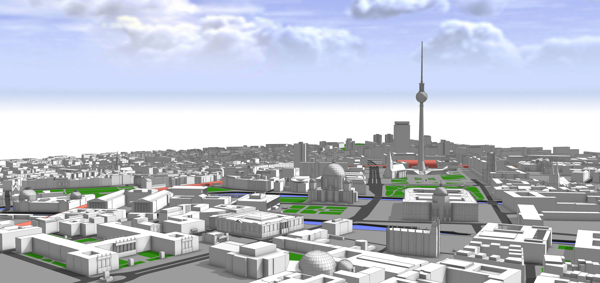

# ArcGIS CityEngine project with detailed 3D building models of Berlin Mitte

This project contains a ArcGIS CityEngine model with ground plane, streets, parcels and 3D models of Berlin Mitte (2x2km)
based on the open data provided by Berlin's Senatsverwaltung für Stadtentwicklung und Wohnen (https://www.stadtentwicklung.berlin.de/).

According to the copyright of the source data (see link above) you may use and modify this project 
as you like, but commercial use is prohibited.

The CityEngine project was originally created for a participatory urban planning application "Enabling DEMO:POLIS", exhibited at the Berlin Academy of Arts in 2016. The source code for the application is available freely as well (see https://robotized.arisona.ch/enabling-demopolis/ for more information).

Compared to the source data, the 3D models in the CityEngine project have been cleaned up with great care (removing duplicate faces, fixing normals, merging vertices etc.). Thus, the model can easily be used for visualization, urban planning scenarios, etc.

If you want to try it out, you can get a free trial of CityEngine at: https://www.esri.com/software/cityengine/free-trial

